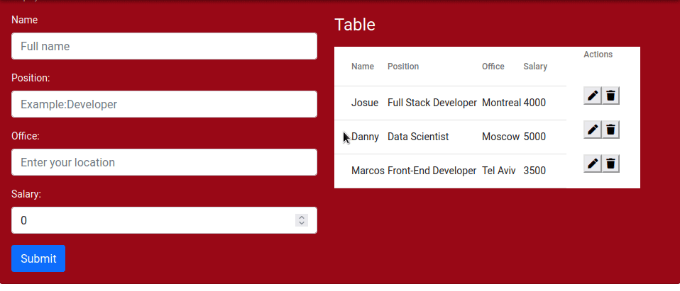

# CRUD-Mean-Stack-Project
The foremost goal of this project was to practice Crud operations using MEAN Stack. The programm was designed to add some user's information,such as: name, position, office and salary. After filling all the empty inputs, user will submit the data in order to be saved in Mongo DB.
  
All data which was sent by user will show up on table, which is located beside the form. Each line of table has two buttons: edit button and delete button. When the user push one of them, it can change the data on desired table's line.

# Project's Image 
Submiting  the Form

Editing and Deleting the table

